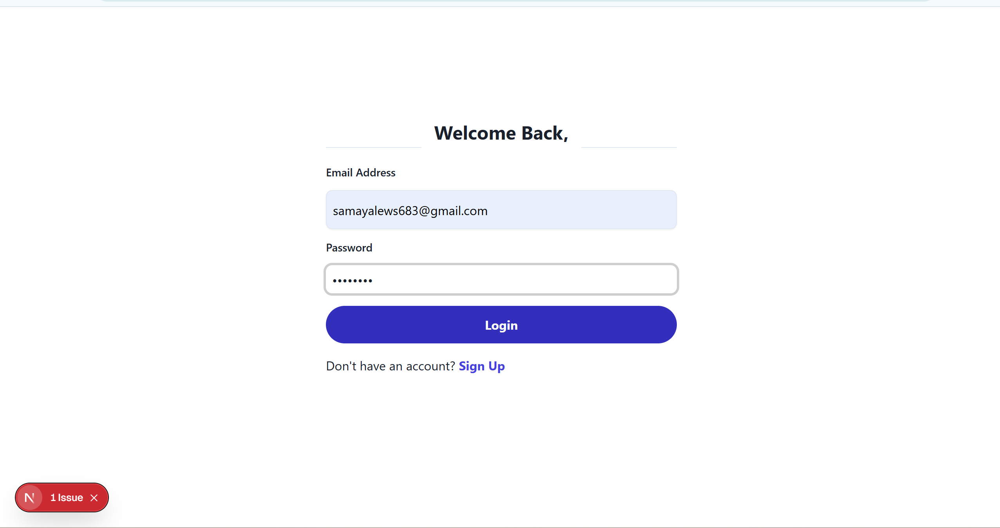
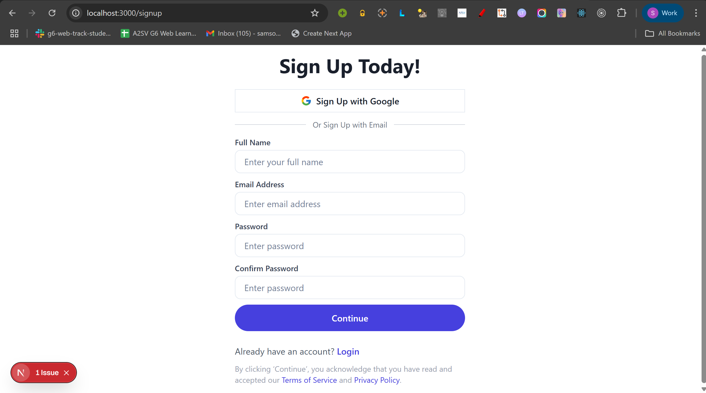
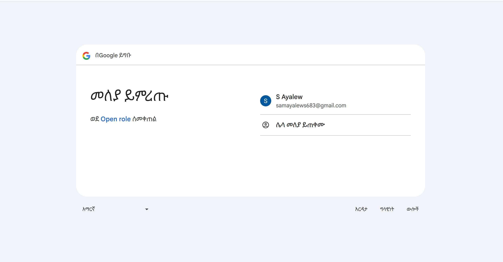
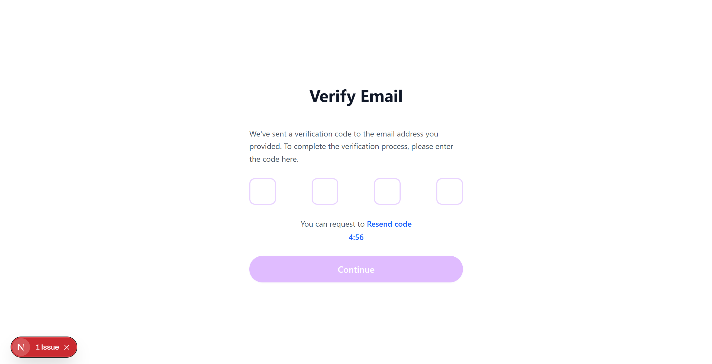
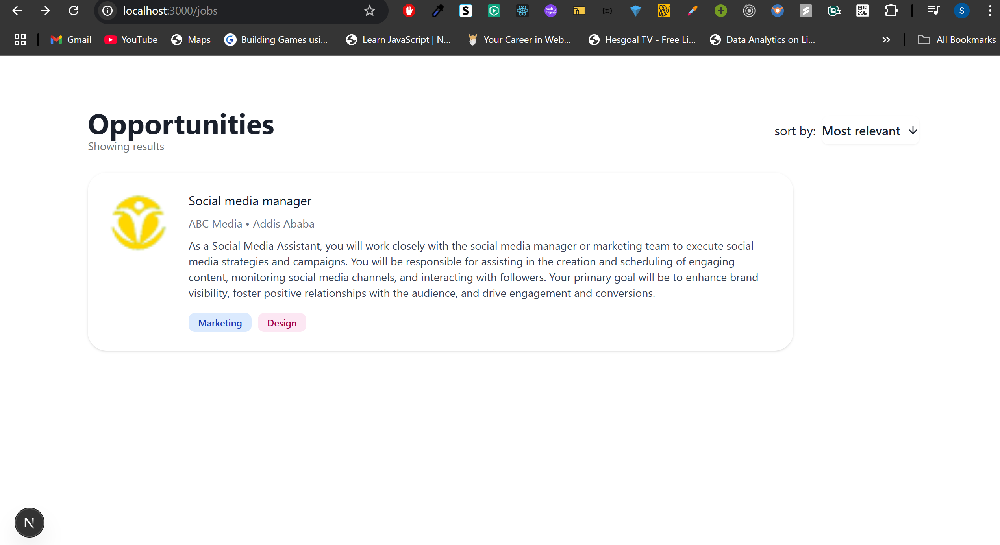
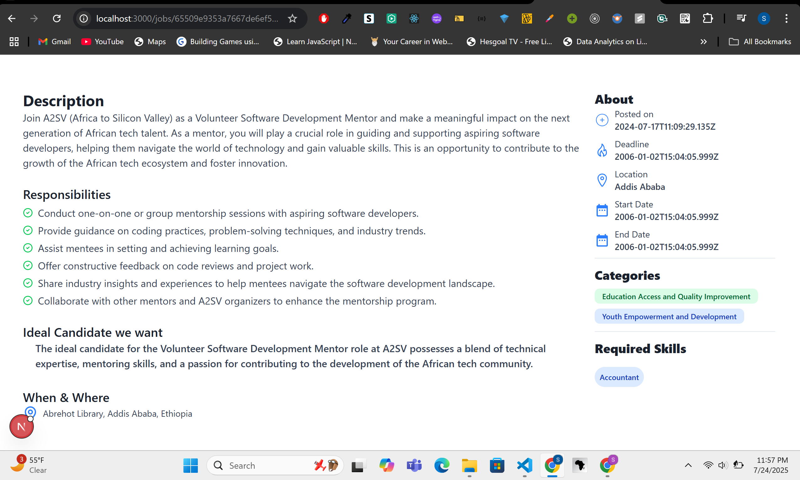
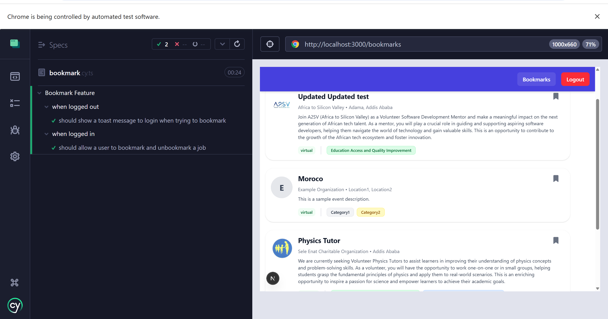
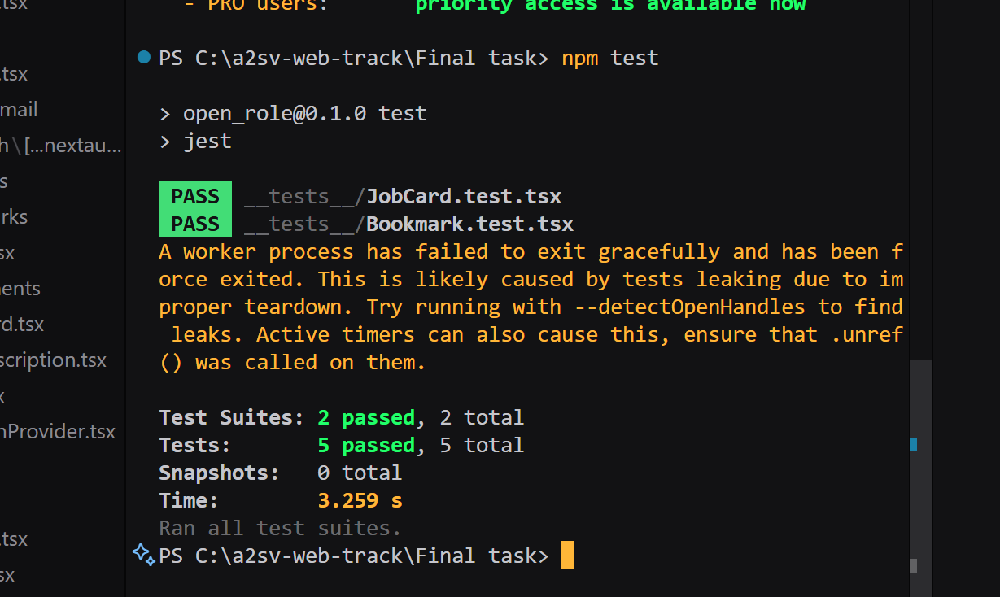

## Getting Started

1. **Clone the repository:**

   ```bash
   git clone https://github.com/samson-16/Open_role.git
   cd Open_role
   ```

2. **Install dependencies:**

   ```bash
   npm install
   # or
   yarn install
   # or
   pnpm install
   # or
   bun install
   ```

3. **Run the development server:**
   ```bash
   npm run dev
   # or
   yarn dev
   # or
   pnpm dev
   # or
   bun dev
   ```

## Features

- Fetches job list and job details from the API endpoints.
- Uses TypeScript types for API data consistency.
- Responsive UI with category color coding.
- Modern UI components (shadcn/ui).

### Bookmark Functionality (Total: 6 points)

- **Toggle Button**: A toggle button is added to the job position card component. It correctly toggles between bookmarked and unbookmarked states. (2 points)
- **Authentication**: Bookmark functionality is restricted to authenticated users only. (2 points)
- **User Feedback**: The application handles successful and failed operations appropriately by providing user feedback (e.g., toast notifications). (2 points)

### Testing (Total: 8 points)

- **Unit Tests**: Unit tests for the bookmark functionality are written using Jest to ensure individual functions work correctly. (3 points)
- **Component Tests**: Component testing is performed to validate the rendering and ensure the job posting card remains consistent. (2 points)
- **End-to-End Tests**: End-to-end tests for the bookmark functionality are written using Cypress. This includes test scenarios for user interactions, including bookmarking and unbookmarking. (3 points)

### Code Quality (Total: 1 point)

- The code is clean, well-organized, and follows best practices and coding conventions. (1 point)

## Screenshots

**Login Page**


**Sign-up Page**


**Sign-up with Google**


**Email Verification Page**


**Job List Page**


**Job Description Page**


**Bookmarks Page**


**Bookmark cypress Tets**



**jest Tets**

